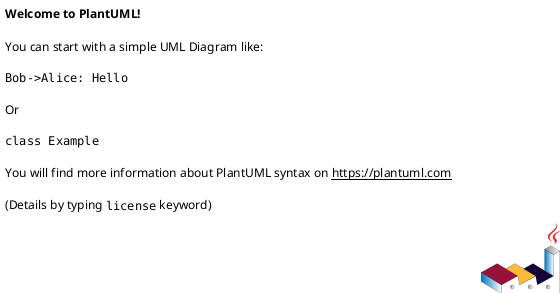
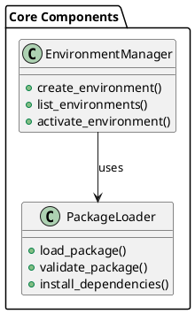
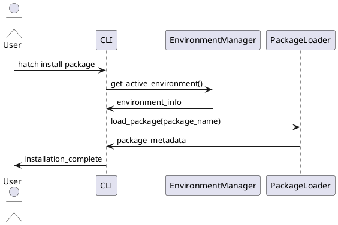
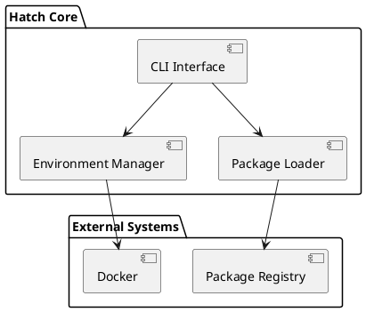
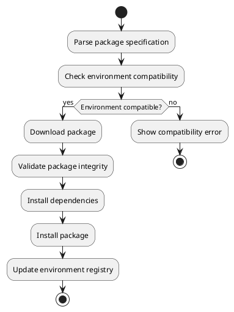
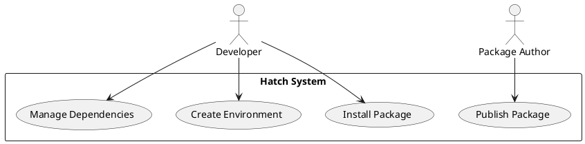

# Documentation Resources Instructions

## Overview
This file defines standards for managing non-markdown assets in documentation, including images, diagrams, and other resources.

## Resource Directory Structure

```
docs/resources/
├── diagrams/                   # PlantUML diagrams
│   ├── architecture/          # System architecture diagrams
│   ├── workflows/             # Process and workflow diagrams
│   ├── api/                   # API interaction diagrams
│   └── <diagram_name>.puml   # Individual diagram files
└── images/                    # Images and other visual assets
    ├── screenshots/           # Application screenshots
    ├── logos/                 # Brand assets and logos
    ├── icons/                 # UI icons and symbols
    └── <image_name>.png      # Individual image files
```

## PlantUML Diagrams

### Overview
All technical diagrams should be created using PlantUML for consistency, version control, and maintainability.

### File Standards
- Write PlantUML diagrams in `docs/resources/diagrams/`
- Use `.puml` file extension
- Use descriptive filenames that indicate the diagram's purpose
- Organize diagrams in subdirectories by category or system area

### Basic Structure
Use the `@startuml` and `@enduml` tags to define diagrams:



### Diagram Types and Resources

#### Class Diagrams
For class diagrams, reference PlantUML documentation at https://plantuml.com/en/class-diagram

**Example Structure:**


#### Sequence Diagrams
For sequence diagrams, reference PlantUML documentation at https://plantuml.com/en/sequence-diagram

**Example Structure:**


#### Component Diagrams
For component diagrams, reference PlantUML documentation at https://plantuml.com/en/component-diagram

**Example Structure:**


#### Activity Diagrams
For activity diagrams, reference PlantUML documentation at https://plantuml.com/en/activity-diagram-beta

**Example Structure:**


#### Use Case Diagrams
For use case diagrams, reference PlantUML documentation at https://plantuml.com/en/use-case-diagram

**Example Structure:**


### Diagram Best Practices

#### Naming Conventions
- Use descriptive names that clearly indicate the diagram's purpose
- Use lowercase with underscores (e.g., `system_architecture.puml`)
- Include the diagram type in the name when helpful (e.g., `user_workflow_sequence.puml`)

#### Content Guidelines
- Keep diagrams focused on a single concept or process
- Use consistent styling and terminology across related diagrams
- Include appropriate titles and descriptions
- Use meaningful names for actors, classes, and components

#### Technical Standards
- Always use `@startuml` and `@enduml` tags
- Include descriptive comments using `'` prefix
- Use consistent color schemes and styling
- Validate diagram syntax before committing

### Referencing Diagrams
Reference diagrams in documentation using relative paths:

```markdown

```

Or with more detailed context:

```markdown
The following diagram illustrates the overall system architecture:


Key components include:
- **CLI Interface**: User-facing command-line interface
- **Environment Manager**: Handles virtual environment lifecycle
- **Package Loader**: Manages package installation and validation
```

## Image Management

### Supported Formats
- **PNG**: Preferred for screenshots and UI elements
- **JPG/JPEG**: For photographs and complex images
- **SVG**: For scalable graphics and simple illustrations
- **GIF**: For animated demonstrations (use sparingly)

### Naming Conventions
- Use descriptive names that indicate the image content
- Use lowercase with hyphens (e.g., `installation-screenshot.png`)
- Include version numbers for screenshots that may change (e.g., `ui-v2.1-dashboard.png`)

### Image Organization
```
docs/resources/images/
├── screenshots/               # Application screenshots
│   ├── installation/         # Installation process screenshots  
│   ├── ui/                   # User interface screenshots
│   └── cli/                  # Command-line interface screenshots
├── logos/                    # Brand assets and logos
│   ├── hatch-logo.png       # Main project logo
│   ├── hatch-icon.png       # Icon version
│   └── partners/            # Partner/dependency logos
├── icons/                    # UI icons and symbols
│   ├── error-icon.png       # Status icons
│   ├── warning-icon.png
│   └── success-icon.png
└── diagrams-rendered/        # Rendered versions of PlantUML diagrams
    ├── architecture.png     # For contexts where PlantUML isn't supported
    └── workflows.png
```

### Image Quality Standards
- **Screenshots**: Use consistent window sizes and zoom levels
- **Resolution**: Provide high-DPI versions for crisp display
- **Compression**: Balance file size with visual quality
- **Consistency**: Use consistent styling, fonts, and color schemes

### Referencing Images
Reference images in documentation using relative paths with alt text:

```markdown

```

Include descriptive captions when helpful:

```markdown

*The help output shows all available commands and their descriptions.*
```

## Asset Management Best Practices

### Version Control
- Include all source files (e.g., `.puml` files) in version control
- Consider including rendered versions for contexts where PlantUML isn't available
- Use meaningful commit messages when updating assets
- Tag important asset versions for reference

### File Size Management
- Optimize images for web display
- Use appropriate compression levels
- Consider providing multiple resolutions for different contexts
- Monitor total repository size and optimize when necessary

### Accessibility
- Always include descriptive alt text for images
- Ensure diagrams have sufficient color contrast
- Provide text descriptions for complex visual information
- Consider screen reader compatibility

### Maintenance
- Regularly review and update screenshots for accuracy
- Update diagrams when system architecture changes
- Remove unused assets to keep repository clean
- Validate that all referenced assets exist and are accessible

## Integration with Documentation

### Cross-References
- Link related diagrams and images within articles
- Create consistent navigation between visual and textual content
- Use images to support and clarify written explanations
- Provide context for standalone visual assets

### Documentation Flow
- Introduce visual assets with appropriate context
- Place images and diagrams near relevant text
- Use consistent formatting for captions and references
- Ensure visual assets enhance rather than distract from content

## Automation and Tools

### PlantUML Integration
- Consider tools that can render PlantUML in documentation builds
- Set up validation for PlantUML syntax
- Automate generation of rendered versions when needed
- Integrate with CI/CD for diagram validation

### Image Optimization
- Use image optimization tools to reduce file sizes
- Automate consistent screenshot capture when possible
- Set up validation for image accessibility standards
- Monitor and report on asset usage and redundancy

## Quality Assurance

### Review Checklist
- [ ] All diagrams use consistent styling and terminology
- [ ] Images have appropriate alt text and captions
- [ ] File names follow naming conventions
- [ ] Assets are organized in appropriate directories
- [ ] All referenced assets exist and are accessible
- [ ] Large files are appropriately optimized
- [ ] Diagrams render correctly in documentation builds

### Regular Maintenance Tasks
- Review asset accuracy and relevance
- Update screenshots for UI changes
- Optimize file sizes and formats
- Validate accessibility compliance
- Clean up unused or redundant assets
- Update diagram content for system changes

## Related Guidelines
- See [Documentation Structure](./documentation-structure.instructions.md) for overall organization
- See [Documentation Style Guide](./documentation-style-guide.instructions.md) for content standards
- See [MkDocs Setup](./documentation-mkdocs-setup.instructions.md) for technical configuration
- See [API Documentation](./documentation-api.instructions.md) for API-specific assets