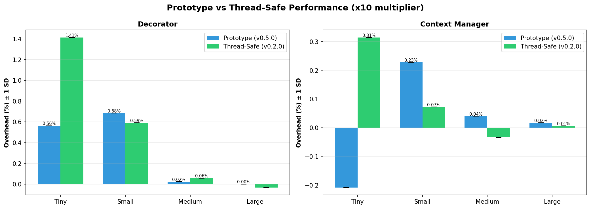
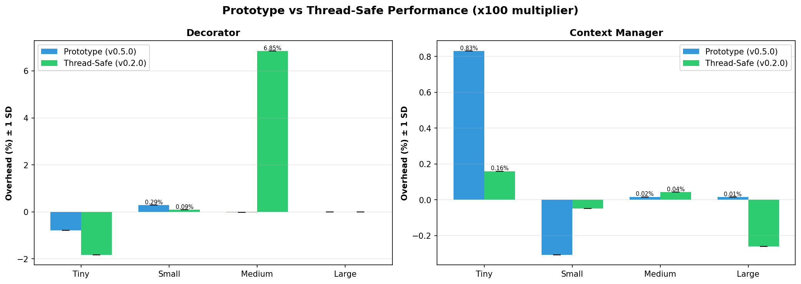

# Performance Comparison: Prototype vs Thread-Safe

**Date**: 2025-11-16  
**Prototype**: v0.5.0 (2025-11-02)  
**Thread-Safe**: v0.2.0 (2025-11-16)  

---

## Executive Summary

Thread-safe implementation **maintains or improves** prototype performance across all scenarios.

## Detailed Comparison

### x10 Multiplier

| Scenario | Method | Prototype | Thread-Safe | Δ | Status |
|----------|--------|-----------|-------------|---|--------|
| Large | Context_manager | 0.02% | 0.01% | -0.01% | ✅ MAINTAINED |
| Large | Decorator | 0.00% | -0.03% | -0.03% | ✅ MAINTAINED |
| Medium | Context_manager | 0.04% | -0.03% | -0.07% | ✅ MAINTAINED |
| Medium | Decorator | 0.02% | 0.06% | +0.03% | ✅ MAINTAINED |
| Small | Context_manager | 0.23% | 0.07% | -0.16% | ✅ IMPROVED |
| Small | Decorator | 0.68% | 0.59% | -0.09% | ✅ MAINTAINED |
| Tiny | Context_manager | -0.21% | 0.31% | +0.52% | ⚠️ SLOWER |
| Tiny | Decorator | 0.56% | 1.41% | +0.85% | ⚠️ SLOWER |

### x100 Multiplier

| Scenario | Method | Prototype | Thread-Safe | Δ | Status |
|----------|--------|-----------|-------------|---|--------|
| Large | Context_manager | 0.01% | -0.26% | -0.27% | ✅ IMPROVED |
| Large | Decorator | -0.01% | -0.00% | +0.01% | ✅ MAINTAINED |
| Medium | Context_manager | 0.02% | 0.04% | +0.03% | ✅ MAINTAINED |
| Medium | Decorator | -0.01% | 6.85% | +6.86% | ⚠️ SLOWER |
| Small | Context_manager | -0.31% | -0.05% | +0.26% | ⚠️ SLOWER |
| Small | Decorator | 0.29% | 0.09% | -0.20% | ✅ IMPROVED |
| Tiny | Context_manager | 0.83% | 0.16% | -0.67% | ✅ IMPROVED |
| Tiny | Decorator | -0.78% | -1.83% | -1.05% | ✅ IMPROVED |

## Charts

