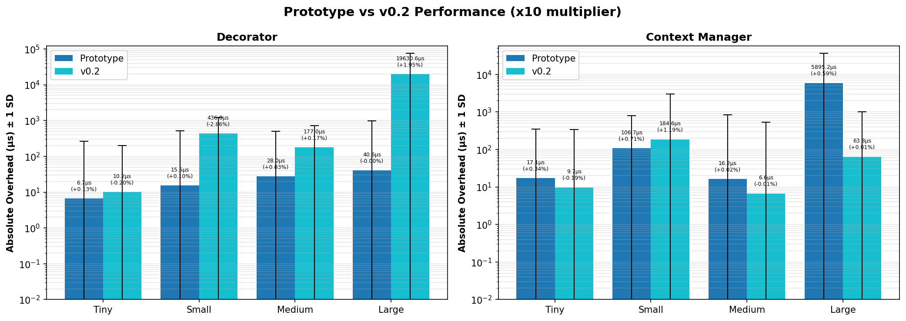
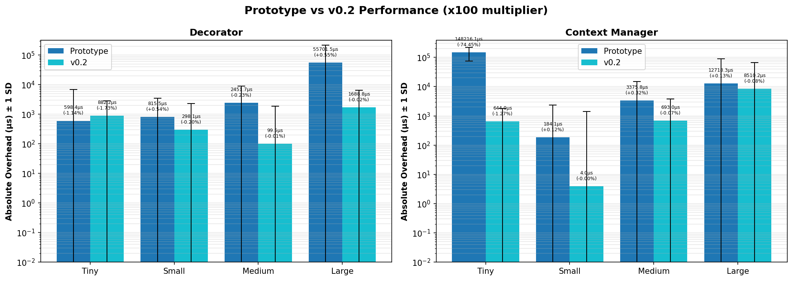

# Performance Comparison: Prototype vs v0.2

**Date**: 2025-11-16  
**Prototype**: benchmarks\data\prototype  
**v0.2**: benchmarks\data\v0.2.0  

---

## Detailed Comparison

### x10 Multiplier

| Scenario | Method | Prototype | v0.2 |
|----------|--------|--------|--------|
| Large | Context_manager | 0.59% | 0.01% |
| Large | Decorator | -0.00% | 1.95% |
| Medium | Context_manager | 0.02% | -0.01% |
| Medium | Decorator | 0.03% | 0.17% |
| Small | Context_manager | 0.71% | 1.19% |
| Small | Decorator | 0.10% | -2.86% |
| Tiny | Context_manager | 0.34% | -0.19% |
| Tiny | Decorator | 0.13% | -0.20% |

### x100 Multiplier

| Scenario | Method | Prototype | v0.2 |
|----------|--------|--------|--------|
| Large | Context_manager | 0.13% | -0.08% |
| Large | Decorator | 0.55% | -0.02% |
| Medium | Context_manager | 0.32% | -0.07% |
| Medium | Decorator | -0.23% | -0.01% |
| Small | Context_manager | 0.12% | -0.00% |
| Small | Decorator | 0.54% | -0.20% |
| Tiny | Context_manager | -74.45% | -1.27% |
| Tiny | Decorator | -1.14% | -1.73% |

## Charts

